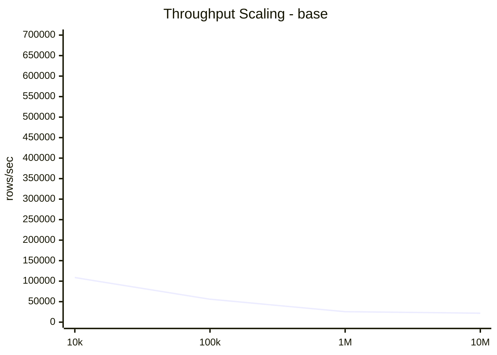
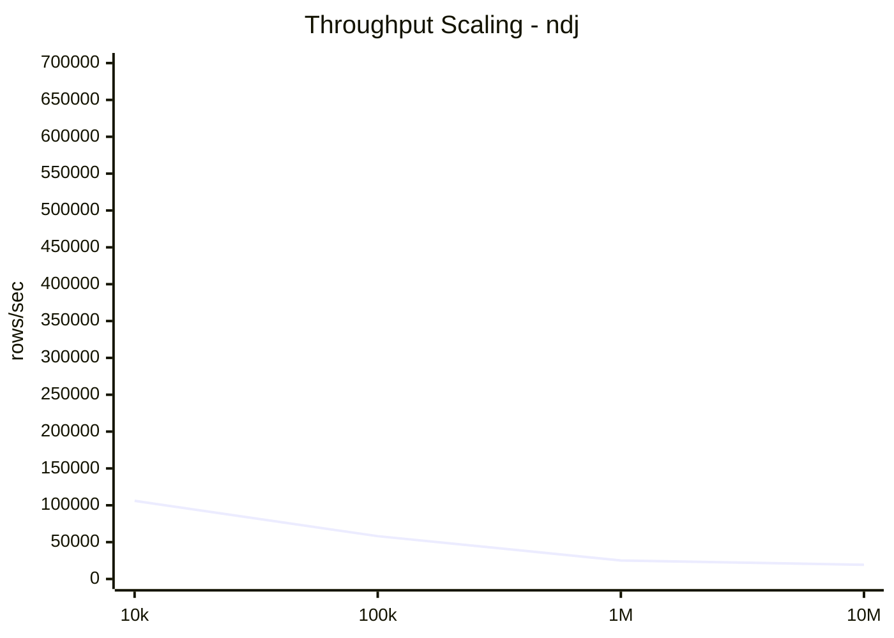
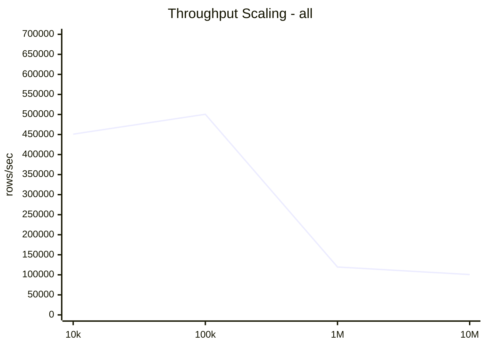
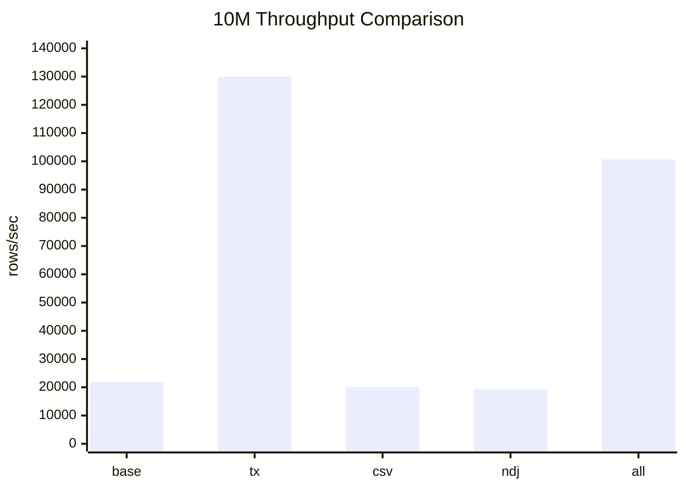
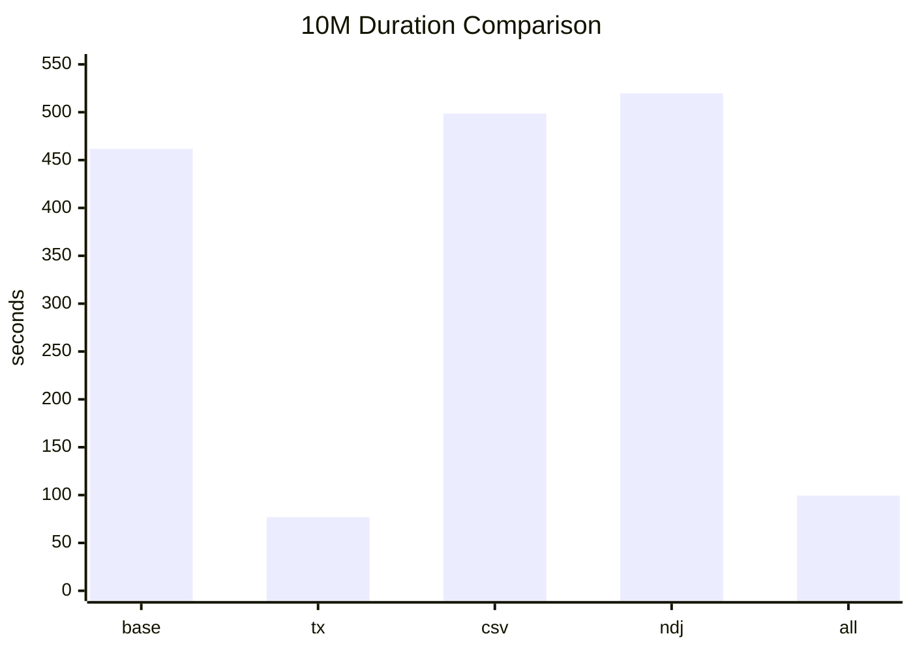
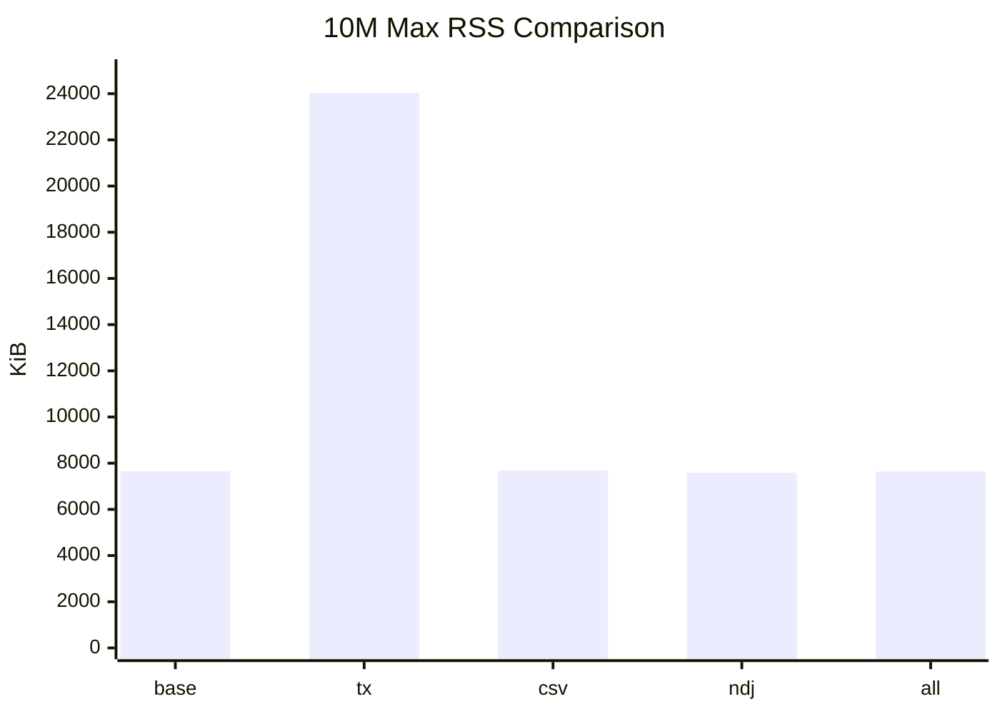
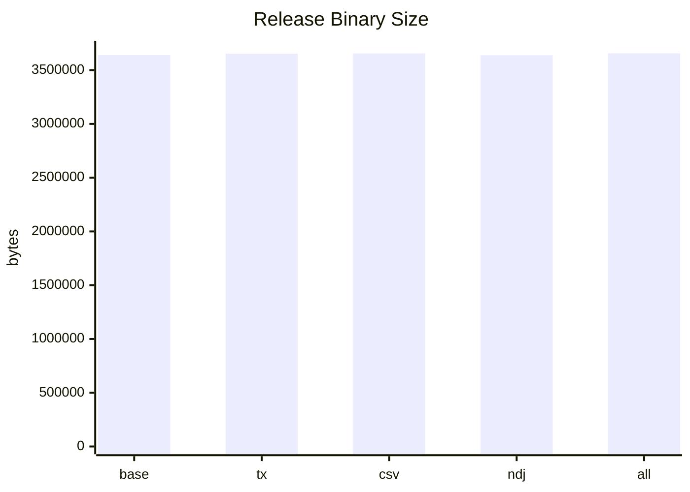

# Metrics

This file tracks the baseline implementation against the active optimization
branches. All values below were measured on Raynhardt's Arch Linux workstation.

## Benchmark Method

```text
Date: 2026-05-12
Fixtures:
  Generated with examples/data_generator.py --dirty
  Scales: 10k, 100k, 1M, 10M input rows
Build:
  cargo build --release
Run:
  target/release/noda-interview --batch-size 1000
Database:
  fresh SQLite database per branch, format, and scale
  database file removed after every individual test
Peak RSS:
  sampled from /proc/<pid>/status VmHWM while the process ran
Binary size:
  stat -c %s target/release/noda-interview
Raw results:
  target/scale-bench-10k-10m-full/results.tsv
```

The CLI reports rows per second from total processed input records. Filtered
rows are reported separately from failed rows because an empty tag is a normal
business filter, not a parsing or write failure.

## Measured Branch Revisions

| Label | Branch | Commit | Purpose |
| --- | --- | --- | --- |
| `base` | `main` | `6b7099e` | Clean baseline plus current docs and benchmark setup. |
| `tx` | `perf/single-transaction` | `02872de` | Use one transaction, avoid duplicate insert errors, and raise SQLite page cache for bulk loading. |
| `csv` | `perf/csv-byterecord` | `44922ed` | Parse CSV with reusable `csv::ByteRecord` instead of serde row deserialization. |
| `ndj` | `perf/ndjson-buffer` | `4a74fbd` | Reuse one buffer while reading NDJSON lines. |
| `all` | `perf/combined` | `badf843` | Combines the earlier transaction, CSV `ByteRecord`, and NDJSON buffer optimizations. |

## Outcome Counts

All measured branches produced the same row outcomes for both CSV and NDJSON at
each scale.

| Scale | Total records | Successful rows | Failed rows | Filtered empty tags |
| ---: | ---: | ---: | ---: | ---: |
| 10,000 | 10,011 | 7,404 | 1,965 | 642 |
| 100,000 | 100,011 | 72,532 | 20,906 | 6,573 |
| 1,000,000 | 1,000,011 | 685,619 | 247,928 | 66,464 |
| 10,000,000 | 10,000,011 | 5,075,233 | 4,259,194 | 665,584 |

## Scaling Summary

Rows/sec, duration, and max RSS are averaged across CSV and NDJSON for the same
branch and scale. Binary size is constant per branch for the release build.

### Average Throughput

| Scale | `base` | `tx` | `csv` | `ndj` | `all` |
| ---: | ---: | ---: | ---: | ---: | ---: |
| 10,000 | 108,814 | 448,401 | 110,094 | 105,992 | 450,932 |
| 100,000 | 55,979 | 684,148 | 56,307 | 58,108 | 500,489 |
| 1,000,000 | 25,514 | 423,214 | 25,011 | 25,101 | 119,496 |
| 10,000,000 | 21,903 | 129,929 | 20,074 | 19,245 | 100,644 |

### Average Duration

| Scale | `base` | `tx` | `csv` | `ndj` | `all` |
| ---: | ---: | ---: | ---: | ---: | ---: |
| 10,000 | 0.092s | 0.022s | 0.091s | 0.095s | 0.022s |
| 100,000 | 1.786s | 0.147s | 1.776s | 1.721s | 0.200s |
| 1,000,000 | 39.197s | 2.366s | 39.983s | 39.840s | 8.369s |
| 10,000,000 | 461.781s | 76.972s | 498.610s | 519.623s | 99.363s |

### Max RSS

| Scale | `base` | `tx` | `csv` | `ndj` | `all` |
| ---: | ---: | ---: | ---: | ---: | ---: |
| 10,000 | 6,008 KiB | 5,944 KiB | 6,036 KiB | 6,000 KiB | 6,032 KiB |
| 100,000 | 7,612 KiB | 11,704 KiB | 7,608 KiB | 7,644 KiB | 7,632 KiB |
| 1,000,000 | 7,608 KiB | 24,020 KiB | 7,752 KiB | 7,648 KiB | 7,540 KiB |
| 10,000,000 | 7,660 KiB | 24,032 KiB | 7,684 KiB | 7,592 KiB | 7,636 KiB |

### Speedup Vs Baseline

| Scale | `tx` | `csv` | `ndj` | `all` |
| ---: | ---: | ---: | ---: | ---: |
| 10,000 | 4.12x | 1.01x | 0.97x | 4.14x |
| 100,000 | 12.22x | 1.01x | 1.04x | 8.94x |
| 1,000,000 | 16.59x | 0.98x | 0.98x | 4.68x |
| 10,000,000 | 5.93x | 0.92x | 0.88x | 4.60x |

### Binary Size

| Branch | Release binary |
| --- | ---: |
| `base` | 3,639,496 bytes |
| `tx` | 3,653,024 bytes |
| `csv` | 3,655,808 bytes |
| `ndj` | 3,638,160 bytes |
| `all` | 3,656,168 bytes |

## Graphs

All graph axes start at zero and use absolute values. Baseline is shown as its
own graph so the reference behavior stays visible.
















## Notes

- `perf/single-transaction` is still the strongest standalone optimization. It
  reaches 129,929 rows/sec at 10M rows, a 5.93x speedup over baseline.
- `perf/single-transaction` spends memory for throughput. Its max RSS rises to
  about 24 MiB once the larger SQLite page cache is active.
- `perf/csv-byterecord` and `perf/ndjson-buffer` do not help at database-heavy
  scales. At 10M rows they are both slower than baseline.
- `perf/combined` is faster than baseline, but slower than the latest
  `perf/single-transaction` branch at every scale above 10k rows. It should not
  be treated as the best branch until it is rebuilt from the latest transaction
  optimization.
