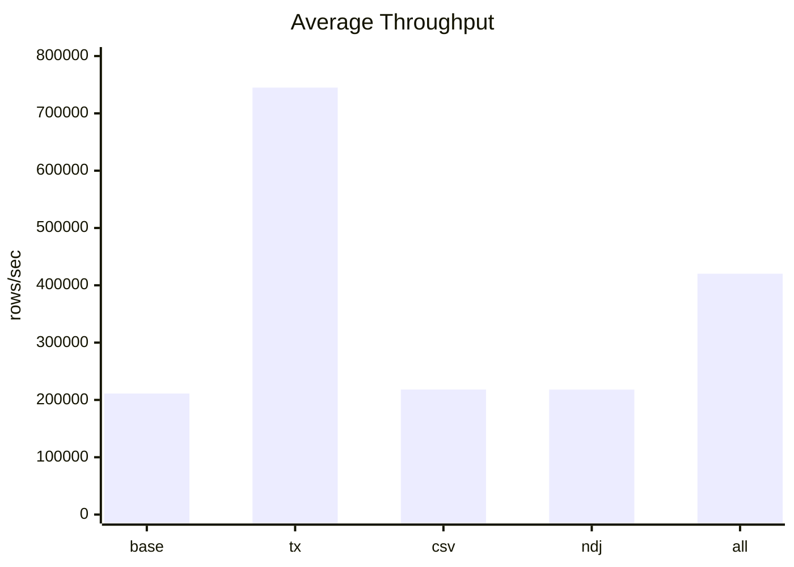
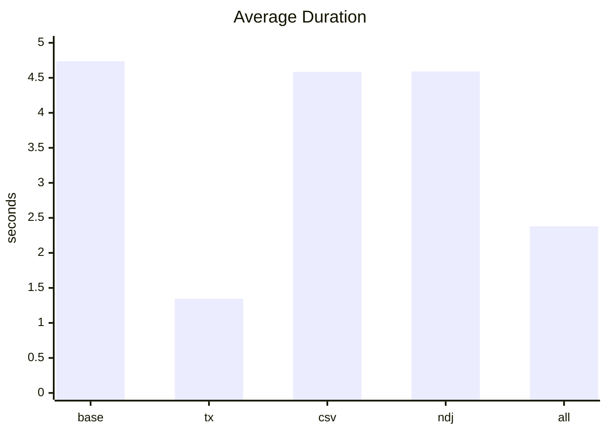
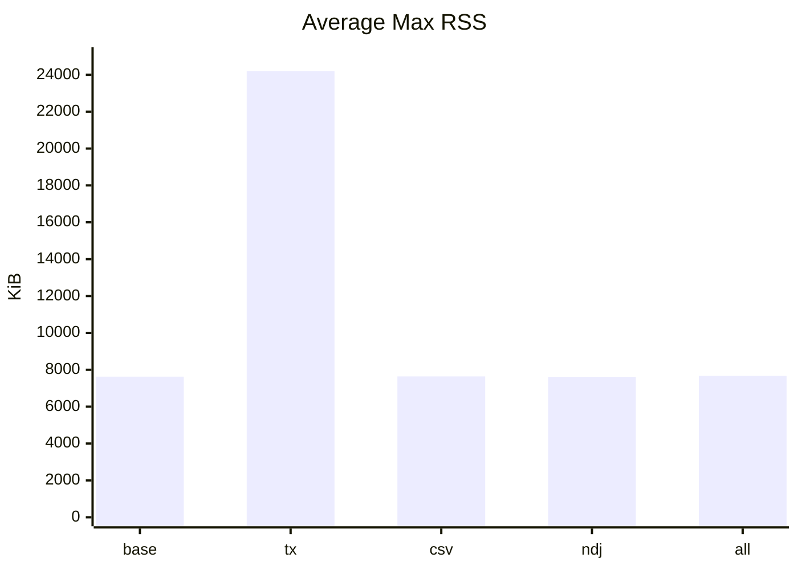
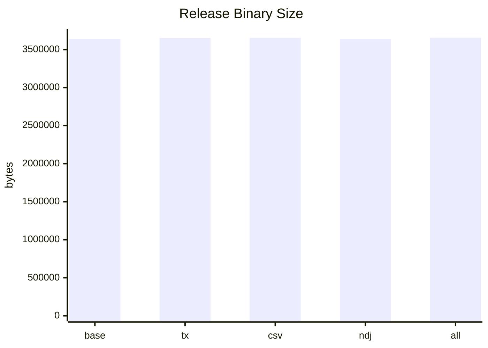
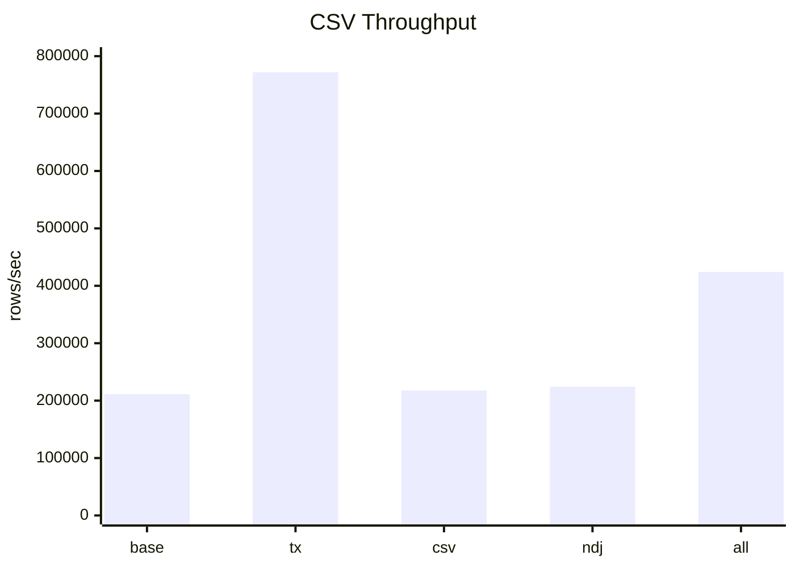
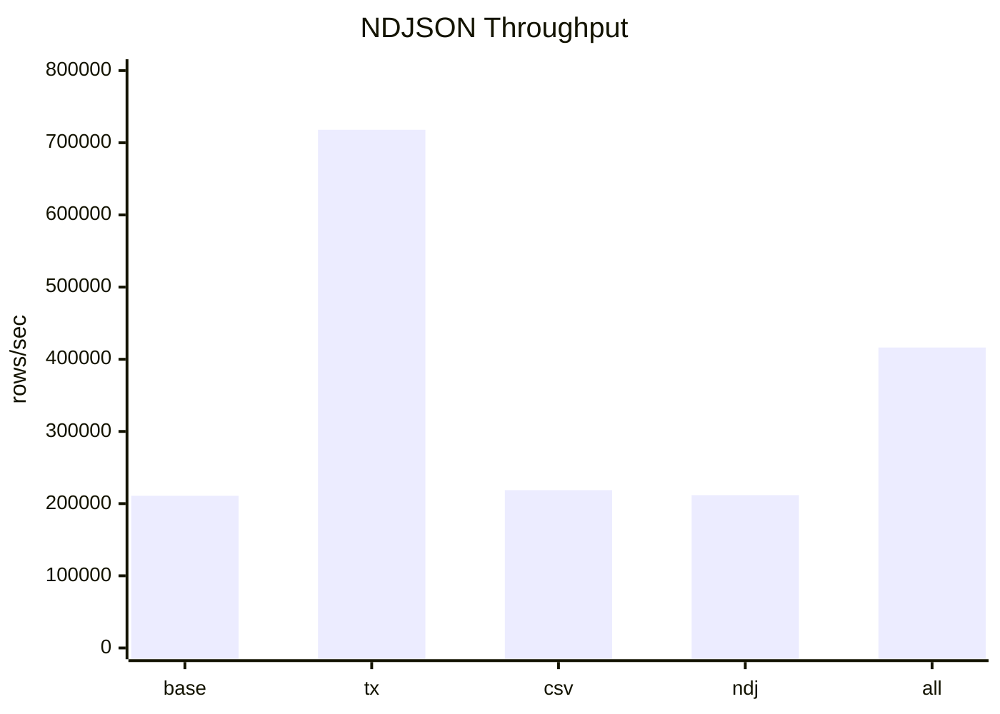

# Metrics

This file tracks baseline performance against the active optimization branches.
All values below were measured on Raynhardt's Arch Linux workstation.

## Benchmark Method

```text
Date: 2026-05-12
Fixture:
  examples/sample.csv: 65 MiB, 1,000,011 logical records
  examples/sample.ndjson: 101 MiB, 1,000,011 records
Build:
  cargo build --release
Run:
  target/release/noda-interview --batch-size 1000
Database:
  fresh temporary SQLite database per format/run
Peak RSS:
  sampled from /proc/<pid>/status VmHWM while the process ran
Binary size:
  stat -c %s target/release/noda-interview
```

The CLI reports rows per second from total processed input records. Filtered
rows are reported separately from failed rows because an empty tag is a normal
business filter, not a parsing or write failure.

## Measured Branch Revisions

| Branch | Commit | Purpose |
| --- | --- | --- |
| `main` | `87c597a` | Clean baseline. |
| `perf/single-transaction` | `02872de` | Use one transaction, avoid duplicate insert errors, and raise SQLite page cache for bulk loading. |
| `perf/csv-byterecord` | `44922ed` | Parse CSV with reusable `csv::ByteRecord` instead of serde row deserialization. |
| `perf/ndjson-buffer` | `4a74fbd` | Reuse one buffer while reading NDJSON lines. |
| `perf/combined` | `badf843` | Combines the single-transaction, CSV `ByteRecord`, and NDJSON buffer optimizations. |

## Outcome Counts

All measured branches produced the same row outcomes for both CSV and NDJSON.

| Metric | Value |
| --- | ---: |
| Total records processed | 1,000,011 |
| Successful rows written | 685,619 |
| Failed rows | 247,928 |
| Filtered empty tags | 66,464 |

## Summary

| Branch | Avg rows/sec | Delta vs base | Avg duration | Avg max RSS | RSS delta | Binary size | Size delta |
| --- | ---: | ---: | ---: | ---: | ---: | ---: | ---: |
| `main` | 211,112 | baseline | 4.737s | 7,628 KiB | baseline | 3,639,496 bytes | baseline |
| `perf/single-transaction` | 744,931 | +533,819 (+252.86%) | 1.344s | 24,196 KiB | +16,568 KiB (+217.20%) | 3,653,024 bytes | +13,528 bytes (+0.37%) |
| `perf/csv-byterecord` | 218,103 | +6,991 (+3.31%) | 4.585s | 7,640 KiB | +12 KiB (+0.16%) | 3,655,808 bytes | +16,312 bytes (+0.45%) |
| `perf/ndjson-buffer` | 217,979 | +6,867 (+3.25%) | 4.591s | 7,614 KiB | -14 KiB (-0.18%) | 3,638,160 bytes | -1,336 bytes (-0.04%) |
| `perf/combined` | 420,240 | +209,128 (+99.06%) | 2.380s | 7,668 KiB | +40 KiB (+0.52%) | 3,656,168 bytes | +16,672 bytes (+0.46%) |

Chart labels:

```text
base = main
tx   = perf/single-transaction
csv  = perf/csv-byterecord
ndj  = perf/ndjson-buffer
all  = perf/combined
```

## Graphs













## Per-Format Speed

| Branch | Format | Duration | Rows/sec | Delta vs same-format base |
| --- | --- | ---: | ---: | ---: |
| `main` | CSV | 4.731s | 211,362.89 | baseline |
| `main` | NDJSON | 4.743s | 210,861.03 | baseline |
| `perf/single-transaction` | CSV | 1.295s | 771,913.25 | +560,550 (+265.21%) |
| `perf/single-transaction` | NDJSON | 1.393s | 717,948.86 | +507,088 (+240.48%) |
| `perf/csv-byterecord` | CSV | 4.598s | 217,488.01 | +6,125 (+2.90%) |
| `perf/csv-byterecord` | NDJSON | 4.572s | 218,717.91 | +7,857 (+3.73%) |
| `perf/ndjson-buffer` | CSV | 4.460s | 224,214.30 | +12,851 (+6.08%) |
| `perf/ndjson-buffer` | NDJSON | 4.723s | 211,742.96 | +882 (+0.42%) |
| `perf/combined` | CSV | 2.358s | 424,163.34 | +212,800 (+100.68%) |
| `perf/combined` | NDJSON | 2.402s | 416,315.69 | +205,455 (+97.44%) |

## Memory And Binary Size

| Branch | CSV max RSS | NDJSON max RSS | Release binary |
| --- | ---: | ---: | ---: |
| `main` | 7,636 KiB | 7,620 KiB | 3,639,496 bytes |
| `perf/single-transaction` | 24,116 KiB | 24,276 KiB | 3,653,024 bytes |
| `perf/csv-byterecord` | 7,668 KiB | 7,612 KiB | 3,655,808 bytes |
| `perf/ndjson-buffer` | 7,596 KiB | 7,632 KiB | 3,638,160 bytes |
| `perf/combined` | 7,676 KiB | 7,660 KiB | 3,656,168 bytes |

## Notes

- `perf/single-transaction` is the clear high-impact speed win in this run.
  The latest pass trades memory for speed by using a 16 MiB SQLite page cache,
  lifting average throughput to about 745k rows/sec.
- `perf/csv-byterecord` has only a small standalone speed gain here, despite
  being useful in the older cumulative optimization chain.
- `perf/ndjson-buffer` has the smallest binary and memory footprint in this
  run, but its direct NDJSON speed improvement is small at this batch size.
- `perf/combined` performs almost as well as `perf/single-transaction`, but the
  added parser changes do not compound into a faster result in this measurement.
- Memory values are low compared with older notes because this measurement uses
  the current clean baseline and sampled process `VmHWM` directly per run.
